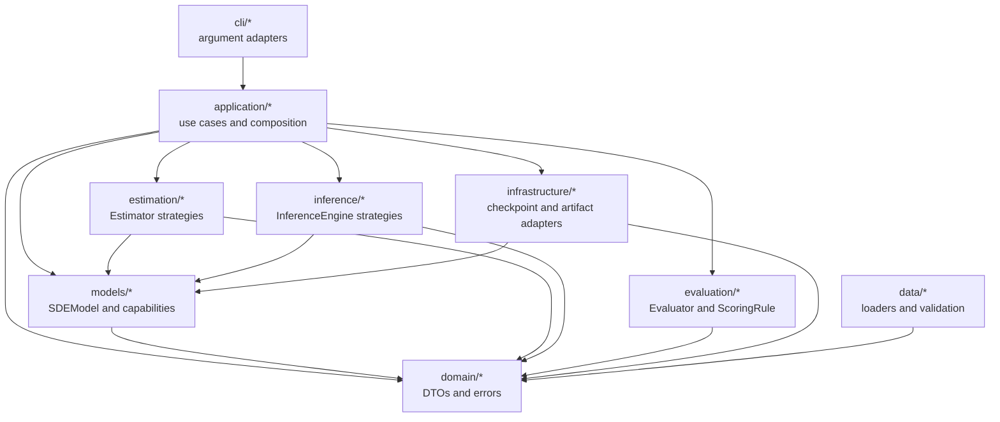
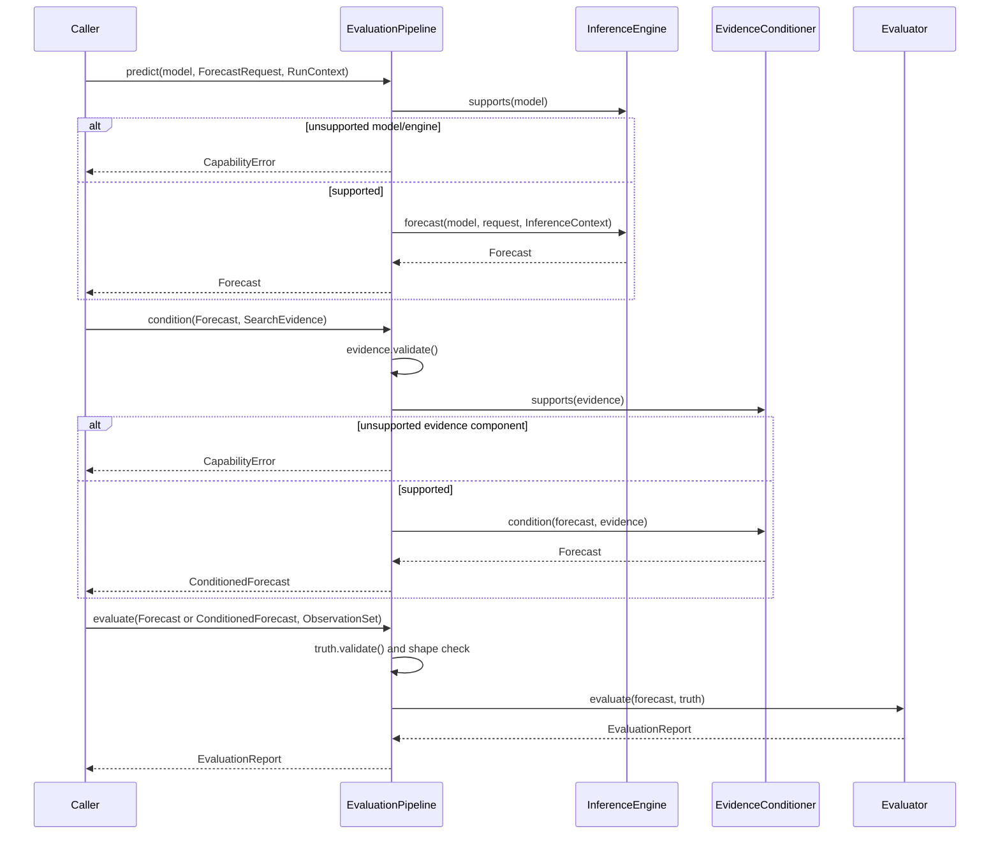

# OOP architecture and migration map

This document describes the architecture that is present in the repository,
how the objects collaborate, and which parts of the approved use-case design
are still migration work. It complements [DESIGN.md](DESIGN.md), which records
the wider target design and scientific constraints.

## 1. Current scope

The framework uses object-oriented boundaries to make scientific components
replaceable without changing their algorithms. It does **not** claim that the
whole migration is complete. The current implementation has two application
entry paths:

1. `ExperimentApplication` is the existing composition root for training,
   checkpoint operations, and legacy `forecast()` calls.
2. `EvaluationPipeline` is the new pure-computation boundary for `predict()`,
   evidence `condition()`, and `evaluate()`.

The next migration slice will make `ExperimentApplication` delegate its public
prediction, conditioning, and evaluation use cases to that pipeline. Until
then, both paths intentionally coexist so the legacy forecast can be used as a
numerical comparison and rollback path.

## 2. Architectural invariants

- Domain DTOs carry validated values; they do not load files or select
  algorithms.
- Models own parameters and implement declared capabilities.
- Estimators, inference engines, evidence conditioners, and scoring rules are
  strategies injected into an application service.
- The application layer owns ordering, capability checks, runtime policy, and
  the eventual commit boundary. It does not contain scientific formulas.
- Infrastructure adapters own checkpoint and artifact I/O.
- CLI modules parse arguments and call application services.
- Unsupported combinations raise an explicit error; no component silently
  substitutes a baseline implementation.
- Application-managed training and prediction paths use random streams owned
  by one `RunContext`. Legacy experiment scripts and standalone numerical
  helpers are outside this Slice A guarantee and may retain their existing
  seed or process-global RNG behavior.

## 3. Package and dependency view

The arrows above are current code dependencies. Data adapters produce domain
values, while the current application modules accept already-prepared inputs
and therefore do not import the `data` package directly.

| Package | Owns | Must not own |
| --- | --- | --- |
| `domain` | Immutable requests/results, validation errors | Files, registries, component selection |
| `models` | SDE parameters, drift/diffusion, optional capabilities | CLI parsing, artifact paths, scoring |
| `estimation` | `Estimator.fit()` strategies and fit context | Model-private mutation outside declared capabilities |
| `inference` | `InferenceEngine.forecast()` and conditioning algorithms | Checkpoint or report persistence |
| `evaluation` | Evaluator and the canonical scoring-rule implementations | Model fitting or data loading |
| `application` | Use-case ordering, dependency injection, fail-fast checks, runtime ownership | EM/SDE/evidence/scoring formulas |
| `infrastructure` | Checkpoint and JSON artifact adapters | Scientific decisions or component fallback |
| `cli` | Argument parsing, exit codes, structured presentation | Training or inference algorithms |

Dependencies point toward stable contracts. In particular, `domain` does not
import application or infrastructure code, and the pure pipelines do not
import filesystem or network adapters.

## 4. Object model

```mermaid
classDiagram
    class ExperimentApplication {
      +from_config(config)
      +train(SegmentEMData) TrainingRun
      +forecast(ForecastRequest) Forecast
      +save_checkpoint(path, metadata)
      +load_checkpoint(path) metadata
    }

    class EvaluationPipeline {
      +predict(model, request, runtime) Forecast
      +condition(forecast, evidence) ConditionedForecast
      +evaluate(forecast, truth) EvaluationReport
    }

    class InferenceEngine {
      <<abstract>>
      +supports(model) bool
      +forecast(model, request, context) Forecast
    }

    class EvidenceConditioner {
      <<protocol>>
      +supports(evidence) bool
      +condition(forecast, evidence) Forecast
    }

    class Evaluator {
      +evaluate(forecasts, observations) EvaluationReport
    }

    class SDEModel {
      <<abstract>>
      +drift(t, state, context)
      +diffusion(t, state, context)
    }

    class RunContext {
      +device
      +dtype
      +random
    }

    class ForecastRequest
    class Forecast
    class SearchEvidence
    class ConditionedForecast
    class ObservationSet
    class EvaluationReport

    EvaluationPipeline o-- InferenceEngine
    EvaluationPipeline o-- EvidenceConditioner
    EvaluationPipeline o-- Evaluator
    EvaluationPipeline --> SDEModel
    EvaluationPipeline --> RunContext
    EvaluationPipeline --> ForecastRequest
    EvaluationPipeline --> Forecast
    EvaluationPipeline --> SearchEvidence
    EvaluationPipeline --> ConditionedForecast
    EvaluationPipeline --> ObservationSet
    EvaluationPipeline --> EvaluationReport

    ExperimentApplication o-- SDEModel
    ExperimentApplication o-- InferenceEngine
    ExperimentApplication o-- RunContext
```

`TrainingData` is an alias of the existing split-aware `TrajectoryDataset`, so
the use-case vocabulary does not create a second source of truth. The legacy
`SegmentEMData` remains supported during migration.

## 5. Abstract contracts and implementation coverage

The number of classes is not a useful OOP maturity measure by itself: most
domain classes are immutable value carriers, while an abstraction matters only
when callers can depend on it and more than one implementation or capability
can be selected without changing the caller.

| Contract | Form | Production implementations | Construction or use | Current limit |
| --- | --- | --- | --- | --- |
| `EvidenceConditioner` | `Protocol` | **No production implementation in Slice A** | Optionally injected into `EvaluationPipeline` | The identity conditioner is a test double only. Existing bridge, existence, and exclusion classes expose domain-specific APIs such as `conditioned_drift()` or `hard_existence()`; they do not yet implement `supports()` plus `condition()` and need later adapters. |
| `SDEModel` | `torch.nn.Module` plus `ABC` | `SegmentConstantSDE`; `TimeVaryingNeuralSDE` is a non-runnable skeleton | `MODEL_REGISTRY` currently constructs the operational I1 model | The neural model deliberately raises `NotImplementedError` pending its separately approved NEX wiring. |
| `ExactTransitionProvider`, `AffineGaussianTransitionProvider`, `ExactGaussianKernelMixin` | Capability ABCs and reusable mixin | `SegmentConstantSDE` | `ExactGaussianEngine.supports()` checks the exact-transition capability | These contracts describe analytic transitions; they are not a general loss-function interface. |
| `LatentRegimeModel` | Capability `ABC` | `SegmentConstantSDE` | The concrete model exposes the regime methods that `SegmentEM` calls | `SegmentEM` remains typed to `SegmentConstantSDE`; it does not yet depend on `LatentRegimeModel` as its abstraction boundary. |
| `ParameterGroupProvider` | Capability `ABC` | `SegmentConstantSDE`; skeleton `TimeVaryingNeuralSDE` | Consumed by `transfer.init.ParameterInitializer` | The neural implementation currently returns empty groups because that model is not wired. |
| `Estimator[ModelT, DataT]` | Generic `ABC` | `SegmentEM`, `CRPSEstimator` | `ESTIMATOR_REGISTRY` registers only `SegmentEM` | `CRPSEstimator` is an explicit unregistered research baseline and does not yet update an SDE model. |
| `InferenceEngine` | `ABC` | `ExactGaussianEngine`, `EulerMaruyamaEngine`, `SplitStepEngine`, `CommonRandomNumberEngine` | All four are available through `INFERENCE_REGISTRY` | Capability support is checked before forecast production; selection remains configuration driven. |
| `ScoringRule` | `ABC` | `EnergyScore`, `GaussianCRPS` | Rules are constructed directly and injected into `Evaluator` | There is no scoring-rule registry because current callers do not require one. |
| `DataSource[T]` | Generic `ABC` | `TrajectorySource` | Constructed by the legacy training CLI/data boundary | Application modules currently accept prepared values rather than importing the data package. |
| `ConditionProvider` | `ABC` | `ConditionSource` | `features_for()` defines segment-identity-based lookup | No production caller currently wires `ConditionSource` into the application or CLI. It supplies model condition features and is distinct from search-evidence conditioning. |

Infrastructure stores are concrete adapters at present. `TorchModelStore` and
`JsonArtifactStore` do not implement a shared store abstraction, and this
document does not invent one before Slice C defines the atomic commit and
`RunRecord` requirements.

### 5.1 Functional core and module-level functions

A module-level function is not automatically an abstraction failure. This
repository keeps calculations and small orchestration helpers at module scope
when they own no persistent object state, and uses objects for replaceable
policy, owned state, resources, or lifecycle. Module-level ownership alone does
not imply that a function is deterministic or free of an injected callback.

| Function category | Examples | Current architectural treatment |
| --- | --- | --- |
| Deterministic formulas | `gaussian_transition_nll`, `crps_gaussian`, `energy_score_d2_closed` | Keep as functions because explicit tensor/scalar inputs determine the result and no selectable lifecycle is required. |
| Stochastic numerical kernels | `energy_score_mc`; the multidimensional branch of `energy_score_gaussian` | Keep as functions because they own no persistent state. They accept a seed, but may consume the process RNG when seed is omitted; application-managed paths must provide explicit randomness when reproducibility is required. |
| Callback orchestration | `poa`, `poa_crn` | Keep as functions for the current legacy surface, but their behavior is delegated to the supplied `rollout_fn` and is not claimed to be a pure deterministic formula. |
| Validation and conversion | `ensure_finite`, `ensure_positive`, `validate_transitions`, `to_phase_space_1d` | Keep as functions; they express reusable checks or transformations rather than component identity. |
| Private numerical helpers | `_finite`, `_kmeans_warmstart`, `_matrix_logm`, `_structure_project`, `_gaussian_pdf` | Keep private to the owning module or class implementation. |
| Stateful or replaceable algorithms | model, estimator, inference-engine, scoring-rule, and data-source implementations | Implement an ABC or capability contract because callers select behavior or supply owned state. |
| Legacy procedural workflows | `iterative_existence`, `iterative_exclusion`, `existence_dual_check`, `robustness_sweep`, and related simulation helpers | Remain function-oriented in the legacy scientific surface. Slice B may adapt the required behavior to `EvidenceConditioner`; it must not wrap every helper merely to increase the class count. |

### 5.2 `estimation/nll.py` specifically

`estimation/nll.py::gaussian_transition_nll` is a stateless Euler one-step,
diagonal-Gaussian formula that accepts already-computed drift and log variance.
It currently has **no production call sites**. The file is retained for the
C-5/C-7 source-to-contract mapping and pending NEX work; retention is not proof
that the function is integrated into the application pipeline.

It must not be conflated with the similarly named model methods:

| Symbol | Meaning and status |
| --- | --- |
| `gaussian_transition_nll` | Standalone diagonal Euler formula; currently uncalled by production code. |
| `ExactGaussianKernelMixin.transition_nll` | Operational analytic-transition NLL using the model's exact mean and full covariance. |
| `SegmentConstantSDE.segment_nll` | Computes one exact-transition NLL per regime by calling the inherited mixin method. |
| `TimeVaryingNeuralSDE.transition_nll` | Frozen future signature only; currently raises `NotImplementedError`. |

There is therefore no common NLL ABC or Protocol today. Introducing one before
the neural path is implemented would hide different covariance and calling
semantics behind a premature abstraction, so that decision remains outside
Slice A.

### 5.3 Current OOP maturity

The repository is a mixed object-oriented and functional architecture, **not highly OOP**
as a whole. Its core model, estimator, inference, scoring, and data
extension points have explicit contracts and several real implementations.
Composition-root coverage is partial, search-evidence conditioning has no
production `EvidenceConditioner`, infrastructure stores have no shared atomic
commit contract, and legacy scientific workflows still combine specialized
classes with module-level functions. Those are visible migration boundaries,
not capabilities that Slice A claims to have completed.

## 6. Prediction, conditioning, and evaluation sequence

The pipeline creates `InferenceContext` from the explicitly supplied
`RunContext`. The caller therefore owns the run lifecycle and the seed; the
inference engine owns only the numerical prediction strategy.

## 7. State, mutation, and I/O boundaries

| Concern | Owner | Current behavior |
| --- | --- | --- |
| Model parameters | `SDEModel` | Standard `torch.nn.Module` parameters and `state_dict()` |
| Training mutation | `Estimator` through model capabilities | Explicit model/data/context inputs |
| Application-managed randomness | `RunContext.random` | Separate training, inference, and bootstrap generators; legacy experiment scripts and standalone helpers remain outside the Slice A guarantee |
| Forecast/evidence/truth values | Domain DTOs | Passed explicitly; no module-level current value |
| Checkpoint I/O | `TorchModelStore` | Called by `ExperimentApplication`, never by a pipeline |
| JSON artifact I/O | `JsonArtifactStore` | Infrastructure adapter only |
| RunRecord and atomic artifact commit | Not implemented yet | Planned for Slice C |

`EvaluationPipeline` has no path, environment, network, or persistence
dependency. A conditioner implementation is also expected to compute and
return a result; registering or persisting evidence belongs at the application
boundary in a later slice.

## 8. Extension points

An extension is connected by implementing one focused contract and registering
it at the composition root:

- A model implements `SDEModel`; optional analytic behavior is exposed through
  capability protocols such as `ExactTransitionProvider`.
- An estimator implements `Estimator.fit(model, data, FitContext)`.
- A prediction strategy implements `InferenceEngine.supports()` and
  `InferenceEngine.forecast()`.
- An evidence strategy implements `EvidenceConditioner.supports()` and
  `EvidenceConditioner.condition()`.
- A metric implements `ScoringRule`; the existing `Evaluator` composes rules.

The application checks capabilities before producing FP/CF/ER values. Adding a
component must not require a new branch inside a model or a silent change to
configuration defaults.

## 9. Implementation status

| Approved slice | Status | Evidence in the repository |
| --- | --- | --- |
| A — contracts and pure pipeline | Implemented in PR #10 | `domain/types.py`, `application/pipelines.py`, `tests/test_use_case_contracts.py` |
| B — compatibility and composition-root APIs | Not implemented | `ExperimentApplication` still exposes legacy `forecast()` and accepts `SegmentEMData`; `predict`, `submit_evidence`, `condition`, and `evaluate` are not wired yet |
| C — atomic artifact commit and RunRecord | Not implemented | Existing stores provide basic checkpoint/JSON I/O only |
| D — representative-arm migration and cleanup | Partially protected, not migrated | Public I1 fixture compares the new pure prediction path with the legacy path; full 22-arm comparison remains out of scope |

This table is part of the architecture contract: documentation must not label a
planned use case as implemented before its executable test exists.

## 10. Verification map

| Architectural claim | Test or check |
| --- | --- |
| Domain inputs reject invalid values | `tests/test_use_case_contracts.py`, `tests/test_validation.py` |
| Unsupported combinations fail explicitly | `tests/test_use_case_contracts.py`, `tests/test_application.py` |
| Pipeline use cases are independently callable | `tests/test_use_case_contracts.py` |
| Pipeline code performs no path I/O | `test_pipeline_methods_do_not_perform_file_io` plus dependency inspection |
| Truth shape matches forecast horizon/state shape | `test_pipeline_rejects_truth_shape_that_does_not_match_forecast` |
| Legacy and new I1 prediction agree | `test_public_i1_fixture_matches_locked_legacy_forecast` |
| Existing numerical behavior remains stable | `tests/test_characterization.py` |
| Public repository boundary remains clean | `scripts/check_public_release.py` |

## 11. Deliberate non-goals

This architecture does not add an event bus, plugin platform, rules engine,
distributed scheduler, GUI, new model family, new scoring formula, or new data
split. Facts/Review/Enhancing are responsibility labels, not new storage
systems. Full environment reconstruction and full 22-arm numerical replay are
separate future work.
