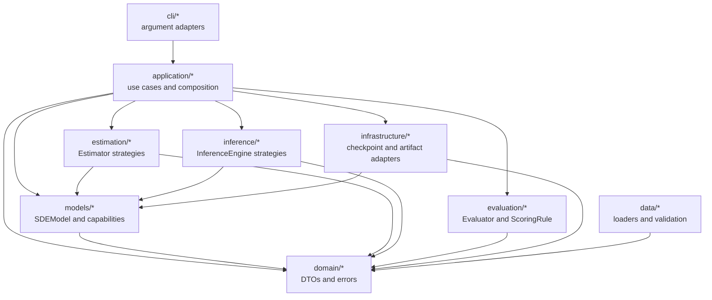
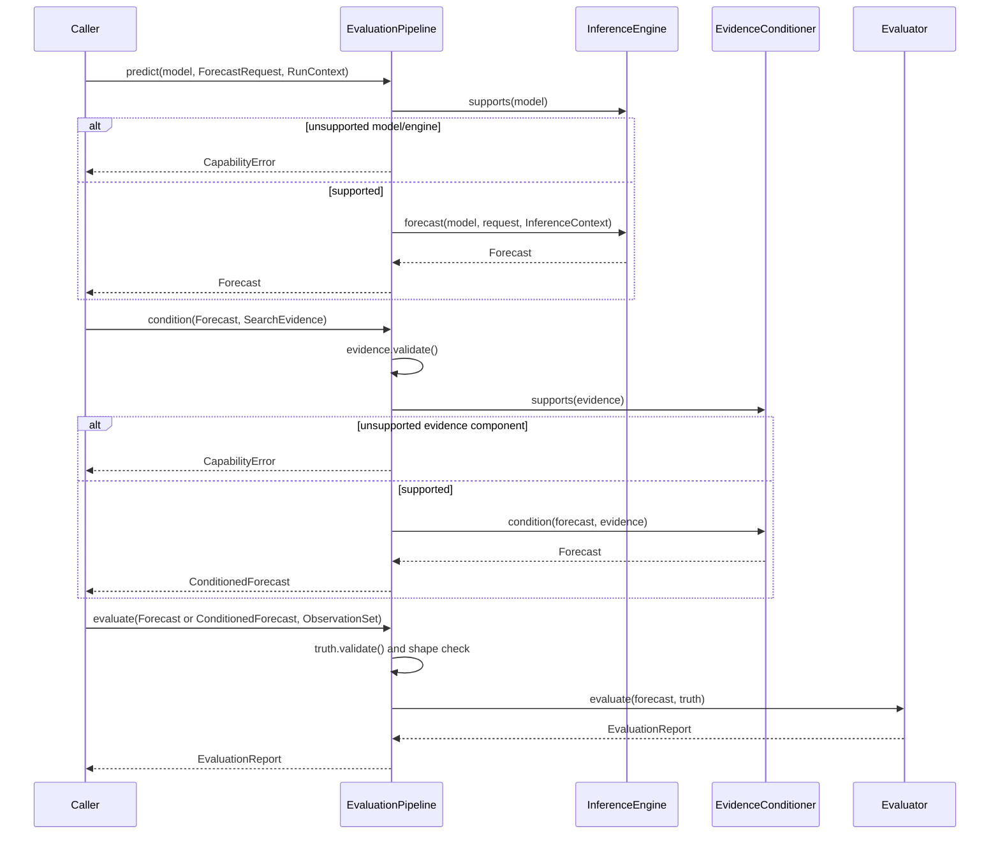

# OOP architecture and migration map

This document describes the architecture that is present in the repository,
how the objects collaborate, and which parts of the approved use-case design
are still migration work. It complements [DESIGN.md](DESIGN.md), which records
the wider target design and scientific constraints.

## 1. Current scope

The framework uses object-oriented boundaries to make scientific components
replaceable without changing their algorithms. It does **not** claim that the
whole migration is complete. The current implementation has two application
entry paths:

1. `ExperimentApplication` is the existing composition root for training,
   checkpoint operations, and legacy `forecast()` calls.
2. `EvaluationPipeline` is the new pure-computation boundary for `predict()`,
   evidence `condition()`, and `evaluate()`.

The next migration slice will make `ExperimentApplication` delegate its public
prediction, conditioning, and evaluation use cases to that pipeline. Until
then, both paths intentionally coexist so the legacy forecast can be used as a
numerical comparison and rollback path.

## 2. Architectural invariants

- Domain DTOs carry validated values; they do not load files or select
  algorithms.
- Models own parameters and implement declared capabilities.
- Estimators, inference engines, evidence conditioners, and scoring rules are
  strategies injected into an application service.
- The application layer owns ordering, capability checks, runtime policy, and
  the eventual commit boundary. It does not contain scientific formulas.
- Infrastructure adapters own checkpoint and artifact I/O.
- CLI modules parse arguments and call application services.
- Unsupported combinations raise an explicit error; no component silently
  substitutes a baseline implementation.
- Application-managed training and prediction paths use random streams owned
  by one `RunContext`. Legacy experiment scripts and standalone numerical
  helpers are outside this Slice A guarantee and may retain their existing
  seed or process-global RNG behavior.

## 3. Package and dependency view

The arrows above are current code dependencies. Data adapters produce domain
values, while the current application modules accept already-prepared inputs
and therefore do not import the `data` package directly.

| Package | Owns | Must not own |
| --- | --- | --- |
| `domain` | Immutable requests/results, validation errors | Files, registries, component selection |
| `models` | SDE parameters, drift/diffusion, optional capabilities | CLI parsing, artifact paths, scoring |
| `estimation` | `Estimator.fit()` strategies and fit context | Model-private mutation outside declared capabilities |
| `inference` | `InferenceEngine.forecast()` and conditioning algorithms | Checkpoint or report persistence |
| `evaluation` | Evaluator and the canonical scoring-rule implementations | Model fitting or data loading |
| `application` | Use-case ordering, dependency injection, fail-fast checks, runtime ownership | EM/SDE/evidence/scoring formulas |
| `infrastructure` | Checkpoint and JSON artifact adapters | Scientific decisions or component fallback |
| `cli` | Argument parsing, exit codes, structured presentation | Training or inference algorithms |

Dependencies point toward stable contracts. In particular, `domain` does not
import application or infrastructure code, and the pure pipelines do not
import filesystem or network adapters.

## 4. Object model

`TrainingData` is an alias of the existing split-aware `TrajectoryDataset`, so
the use-case vocabulary does not create a second source of truth. The legacy
`SegmentEMData` remains supported during migration.

## 5. Prediction, conditioning, and evaluation sequence

The pipeline creates `InferenceContext` from the explicitly supplied
`RunContext`. The caller therefore owns the run lifecycle and the seed; the
inference engine owns only the numerical prediction strategy.

## 6. State, mutation, and I/O boundaries

| Concern | Owner | Current behavior |
| --- | --- | --- |
| Model parameters | `SDEModel` | Standard `torch.nn.Module` parameters and `state_dict()` |
| Training mutation | `Estimator` through model capabilities | Explicit model/data/context inputs |
| Application-managed randomness | `RunContext.random` | Separate training, inference, and bootstrap generators; legacy experiment scripts and standalone helpers remain outside the Slice A guarantee |
| Forecast/evidence/truth values | Domain DTOs | Passed explicitly; no module-level current value |
| Checkpoint I/O | `TorchModelStore` | Called by `ExperimentApplication`, never by a pipeline |
| JSON artifact I/O | `JsonArtifactStore` | Infrastructure adapter only |
| RunRecord and atomic artifact commit | Not implemented yet | Planned for Slice C |

`EvaluationPipeline` has no path, environment, network, or persistence
dependency. A conditioner implementation is also expected to compute and
return a result; registering or persisting evidence belongs at the application
boundary in a later slice.

## 7. Extension points

An extension is connected by implementing one focused contract and registering
it at the composition root:

- A model implements `SDEModel`; optional analytic behavior is exposed through
  capability protocols such as `ExactTransitionProvider`.
- An estimator implements `Estimator.fit(model, data, FitContext)`.
- A prediction strategy implements `InferenceEngine.supports()` and
  `InferenceEngine.forecast()`.
- An evidence strategy implements `EvidenceConditioner.supports()` and
  `EvidenceConditioner.condition()`.
- A metric implements `ScoringRule`; the existing `Evaluator` composes rules.

The application checks capabilities before producing FP/CF/ER values. Adding a
component must not require a new branch inside a model or a silent change to
configuration defaults.

## 8. Implementation status

| Approved slice | Status | Evidence in the repository |
| --- | --- | --- |
| A — contracts and pure pipeline | Implemented in PR #10 | `domain/types.py`, `application/pipelines.py`, `tests/test_use_case_contracts.py` |
| B — compatibility and composition-root APIs | Not implemented | `ExperimentApplication` still exposes legacy `forecast()` and accepts `SegmentEMData`; `predict`, `submit_evidence`, `condition`, and `evaluate` are not wired yet |
| C — atomic artifact commit and RunRecord | Not implemented | Existing stores provide basic checkpoint/JSON I/O only |
| D — representative-arm migration and cleanup | Partially protected, not migrated | Public I1 fixture compares the new pure prediction path with the legacy path; full 22-arm comparison remains out of scope |

This table is part of the architecture contract: documentation must not label a
planned use case as implemented before its executable test exists.

## 9. Verification map

| Architectural claim | Test or check |
| --- | --- |
| Domain inputs reject invalid values | `tests/test_use_case_contracts.py`, `tests/test_validation.py` |
| Unsupported combinations fail explicitly | `tests/test_use_case_contracts.py`, `tests/test_application.py` |
| Pipeline use cases are independently callable | `tests/test_use_case_contracts.py` |
| Pipeline code performs no path I/O | `test_pipeline_methods_do_not_perform_file_io` plus dependency inspection |
| Truth shape matches forecast horizon/state shape | `test_pipeline_rejects_truth_shape_that_does_not_match_forecast` |
| Legacy and new I1 prediction agree | `test_public_i1_fixture_matches_locked_legacy_forecast` |
| Existing numerical behavior remains stable | `tests/test_characterization.py` |
| Public repository boundary remains clean | `scripts/check_public_release.py` |

## 10. Deliberate non-goals

This architecture does not add an event bus, plugin platform, rules engine,
distributed scheduler, GUI, new model family, new scoring formula, or new data
split. Facts/Review/Enhancing are responsibility labels, not new storage
systems. Full environment reconstruction and full 22-arm numerical replay are
separate future work.
